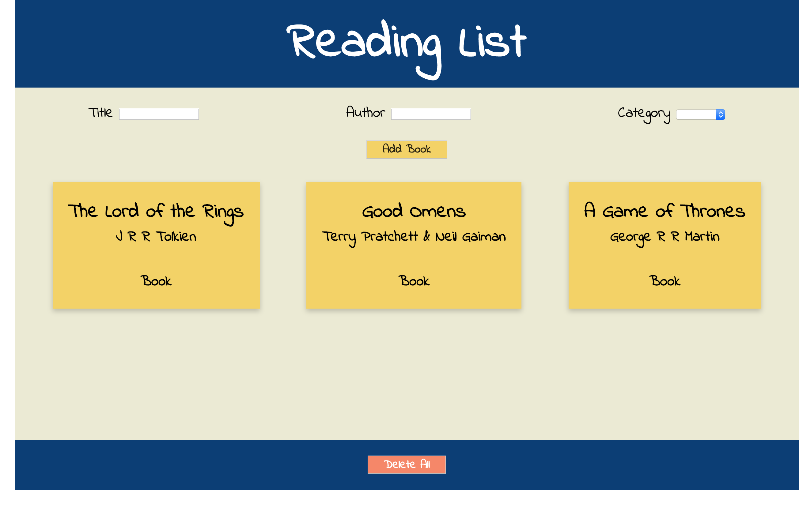

# Reading List

### Learning Objectives

- Be able to use a variety of event listener types
- Be able to access values from form inputs on submit
- Be able to attach events to a variety of DOM elements
- Be able to read and write to the DOM

## Brief

Your task is to create a Reading List app that allow a user to submit items they intend to read later and view them on the page.

